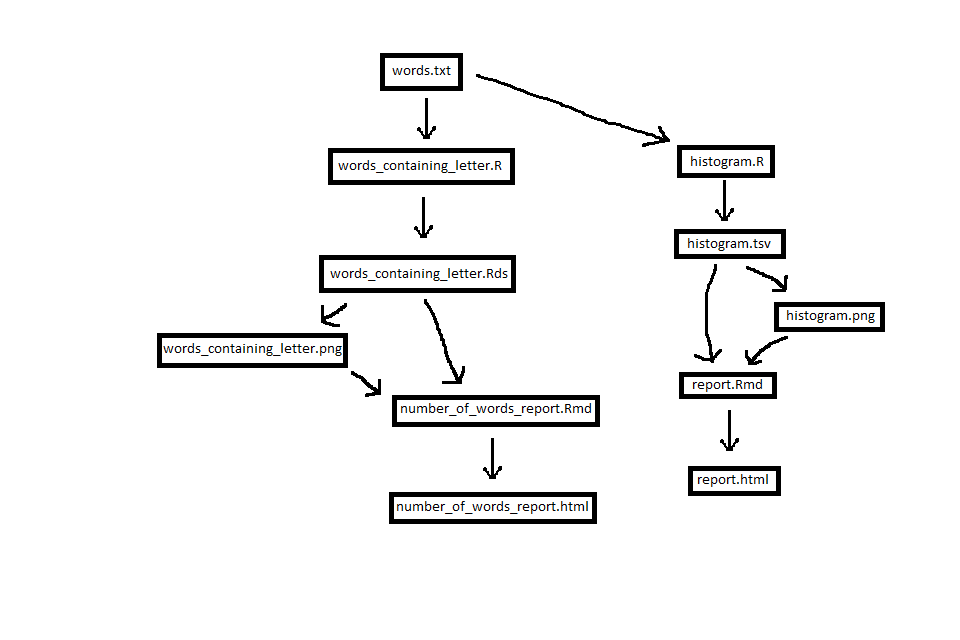

Stat 547 HW09 Repository
=============

Hello! In this repository you will find all the relevant files for an automated data-analysis using Pipelines. These are modified versions of the original files found at [https://github.com/STAT545-UBC/make-activity](https://github.com/STAT545-UBC/make-activity).

The automated data-analysis which I added was an investigation of the number of words containing a given letter of the alphabet. In particular, I made the following additions:

  * An R script, `words_containing_letter.R`, which computes the number of words that contain a given letter of the alphabet and writes an RDS file `words_containing_letter.rds` containing this infomation.
  * An Rmd file, `number_of_words_report.Rmd` which summarises the results.  
  * I modified the original makefile to create both the above RDS file and a `words_containing_letter.png`png file, and then knit the Rmd file into an html document, `number_of_words_report.html`.
  
Here is a visual of the Pipeline (made in Paint!):

 

