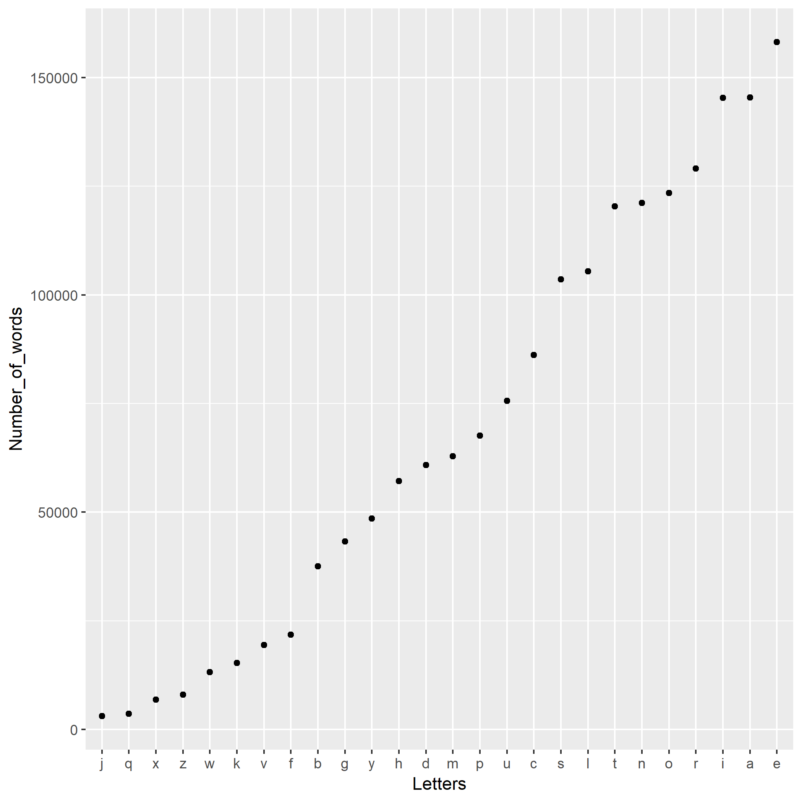

In this analysis, we investigate the frequency of words that contain a given letter of the alphabet. The list of words we use is available from the web at [http://svnweb.freebsd.org/base/head/share/dict/web2?view=co](http://svnweb.freebsd.org/base/head/share/dict/web2?view=co). 
```{r, include = FALSE}
freq_data <- readRDS("words_containing_letter.rds")
```


The most frequent letter appearing in the list of words is the letter `r freq_data$Letters[which.max(freq_data$Number_of_words)]`, and the least frequent is the letter `r freq_data$Letters[which.min(freq_data$Number_of_words)]`.




```{r make table}
knitr::kable(freq_data)
```


