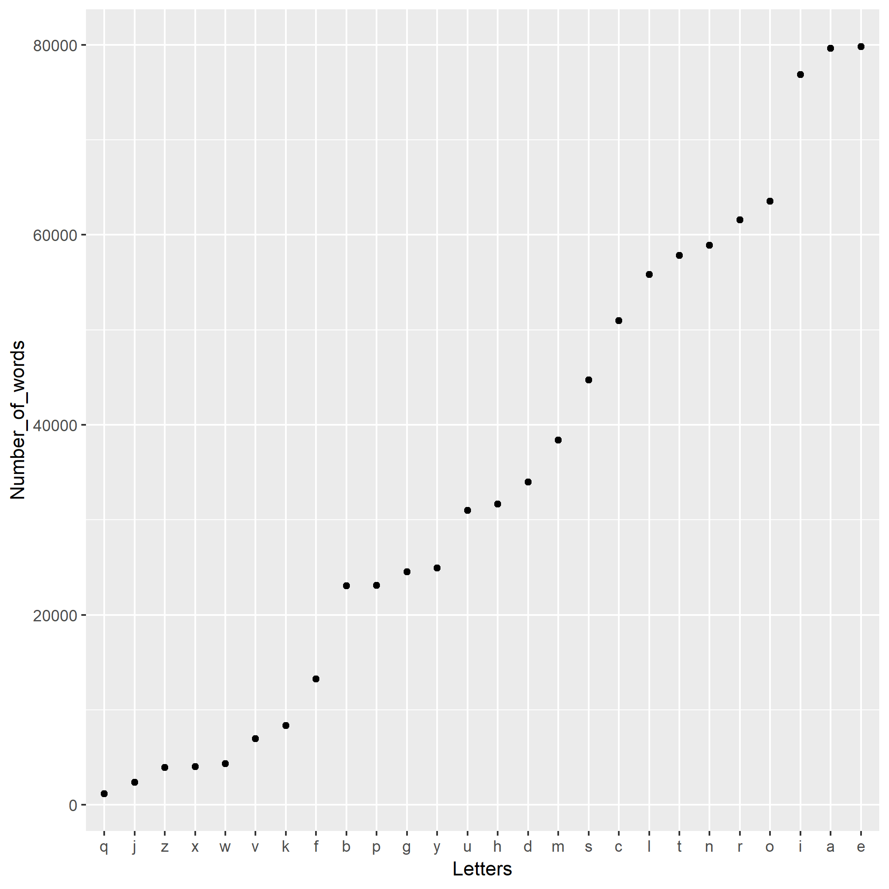

In this analysis, we investigate the frequency of words that contain a given letter of the alphabet. The list of words we use is available from the web at [http://svnweb.freebsd.org/base/head/share/dict/web2?view=co](http://svnweb.freebsd.org/base/head/share/dict/web2?view=co). 


The most frequent letter appearing in the list of words is the letter e, and the least frequent is the letter q.





```r
knitr::kable(freq_data)
```


Letters    Number_of_words
--------  ----------------
a                    79627
b                    23048
c                    50964
d                    33970
e                    79785
f                    13233
g                    24519
h                    31655
i                    76865
j                     2378
k                     8356
l                    55818
m                    38401
n                    58921
o                    63517
p                    23110
q                     1190
r                    61559
s                    44744
t                    57810
u                    30997
v                     6971
w                     4323
x                     4023
y                    24938
z                     3940


